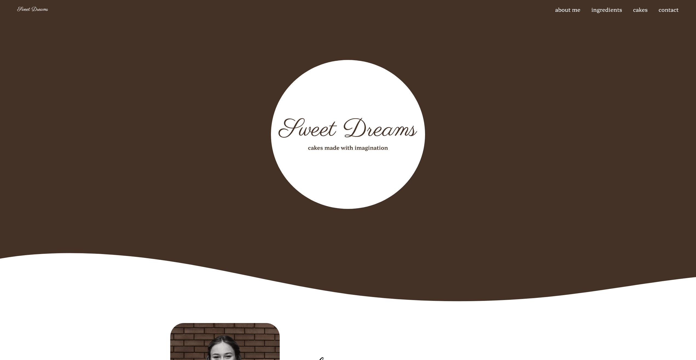
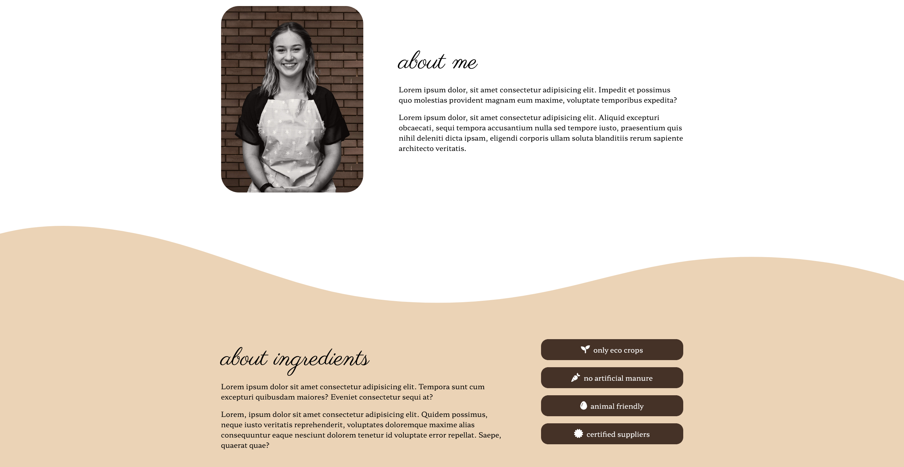
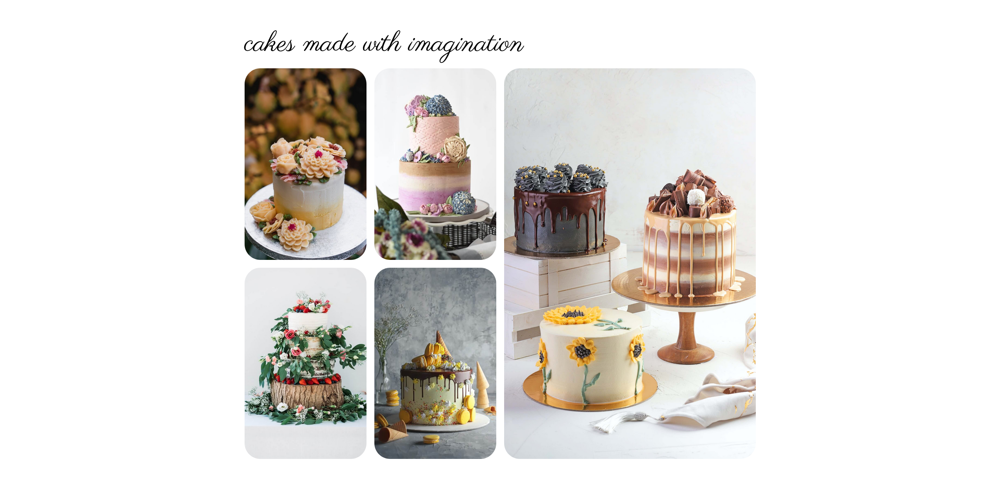

# Sweet Dreams

This is a gallery website for a baker specialising in cakes and cupcakes.

## Table of contents

- [Overview](#overview)
  - [The challenge](#the-challenge)
  - [Screenshot](#screenshot)
  - [Links](#links)
- [My process](#my-process)
  - [Built with](#built-with)
  - [Continued development](#continued-development)
  - [Useful resources](#useful-resources)
- [Author](#author)

## Overview

### The challenge

I built this project to learn CSS Grid, so the challenge was to position images properly on all devices according to my design in Figma. It was rebuilt after I completed Conquering Responsive Layouts Challenge (by Kevin Powell) to adhere to best practices in organising code, as for my understanding so far :)

### Screenshot

### Links

- Live Site URL: [Sweet Dreams](https://nostalgic-bardeen-1be2ab.netlify.app/)

## My process

### Built with

- Semantic HTML5 markup
- SASS
- Grid
- Figma (design)

### Continued development

I'd like to add a cake shop functionality ana add some subtle animations.

### Useful resources

- [Kevin Powell's YouTube channel](https://www.youtube.com/kepowob) - Kevin has some very helpful videos about CSS, I learned a lot about CSS Grid and responisive websites from him
- [Kevin Powell's Conquering Responsive Layouts Challenge](https://courses.kevinpowell.co/conquering-responsive-layouts) - This challenge helped me better organise both my CSS and HTML

## Author

- LinkedIn - [Lidia Krajewska](https://www.linkedin.com/in/lidia-krajewska-02512a1a7/)
- Frontend Mentor - [@lidiakrajewska](https://www.frontendmentor.io/profile/lidiakrajewska)
